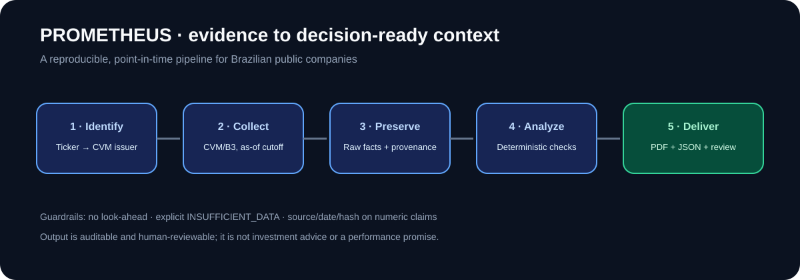
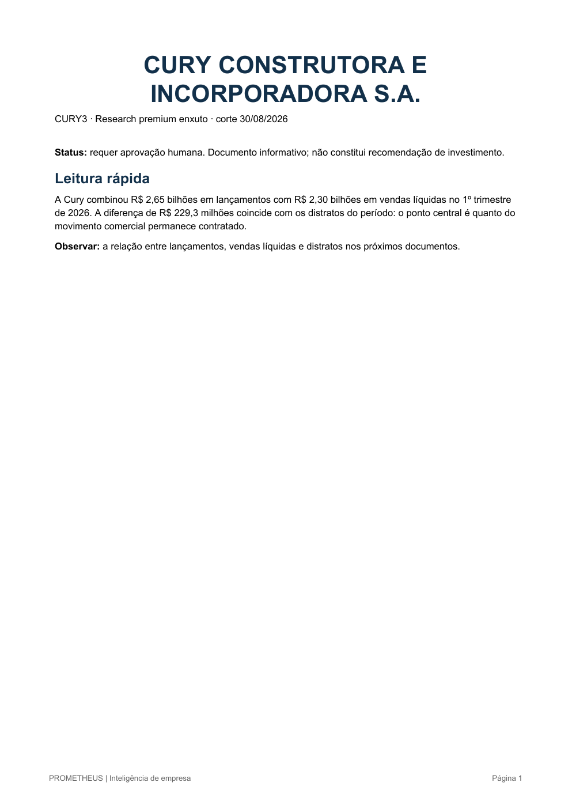

# PROMETHEUS

### Point-in-time financial intelligence for Brazilian companies

PROMETHEUS is a Python research engine that turns public CVM/B3 evidence into
explainable, auditable company analysis. It preserves information cutoffs,
keeps raw provenance, validates claims deterministically and exports a
human-reviewable PDF.

> Technical portfolio project. It is not investment advice, does not promise
> returns and is not a substitute for a regulated analyst or suitability review.

**Portfolio snapshot:** Python · CVM/B3 provenance · point-in-time controls ·
deterministic validation · auditable PDF/JSON outputs · human review workflow.

> Start here: [five-minute portfolio demo](docs/PORTFOLIO_DEMO.md) ·
> [architecture](docs/ARCHITECTURE.md) · [engineering decisions](docs/ENGINEERING_DECISIONS.md) ·
> [current validation status](docs/VALIDATION_STATUS.md)



*The local demonstration report is rendered from the same pipeline described
above; this preview is included only to make the portfolio reviewable at a
glance.*



## Why it is interesting

Financial data is messy: filings are revised, documents arrive at different
times, providers normalize facts differently and missing data is common.
PROMETHEUS treats those constraints as engineering requirements.

```text
ticker -> issuer/CVM identity -> point-in-time collection
       -> normalization + provenance -> deterministic analysis
       -> evidence ledger + editorial gate -> PDF + JSON audit export
       -> human review / approval / delivery
```

## Implemented capabilities

- Exact ticker → CNPJ → CVM identity mapping.
- Point-in-time cutoff checks and look-ahead rejection.
- CVM ITR/DFP/IPE/FRE and B3 COTAHIST adapters.
- Raw facts, normalized values, units, periods, versions and source hashes.
- Sector-aware KPI extraction where an official parser is validated.
- Deterministic peer eligibility and valuation traceability.
- Evidence classifications: fact, calculation, interpretation, estimate, risk and limitation.
- Editorial gate for incomplete or contradictory deliverables.
- PDF research reports, audit appendix and JSON claims export.
- Append-only JournalEngine, replay and regression monitoring.
- Qualitative content layer for sourced posts, scripts and questions.

## Demonstration

The local validation set includes a CURY3 example with **16/18 traceable
operational KPIs** from an official CVM document. Generated PDFs and caches are
excluded from Git; the reproducible workflow is documented in
[docs/PORTFOLIO_DEMO.md](docs/PORTFOLIO_DEMO.md).

## A useful way to review the project

1. Read the pipeline diagram above and open `prometheus/` to see the separation
   between collection, normalization, provenance and analysis.
2. Run the tests, then execute the offline CURY3 command below with an audited
   snapshot.
3. Open the generated PDF beside its JSON export and trace one KPI from source
   document to claim and rendered output.

The repository intentionally states its boundaries: sector coverage is not
universal, external feeds can be unavailable, statistical backtesting is not a
track record, and a human must review any report before delivery.

## Quick start

```powershell
python -m venv .venv
.venv\Scripts\Activate.ps1
python -m pip install -e ".[dev]"
python -m pytest -q
```

For an offline run, provide an audited market snapshot or B3 COTAHIST file and
an explicit instrument catalog:

```powershell
prometheus-research --ticker CURY3 `
  --instrument-catalog config\instrument_catalog.json `
  --market-snapshot data\market_snapshot.json `
  --as-of 2026-08-30 `
  --report-json output\cury3.json `
  --report-pdf output
```

## Project map

| Path | Purpose |
| --- | --- |
| `prometheus/` | Core engine and data adapters |
| `tests/` | Unit, integration and regression tests |
| `config/` | Versioned issuer/instrument configuration examples |
| `scripts/` | Release, catalog, audit and diagnostics |
| `docs/` | Methodology, operations and architecture |
| `main.py` | CLI entry point |

## Evidence, not silent fallbacks

Unavailable facts are recorded as `INSUFFICIENT_DATA`; current values are never
silently substituted. Every numeric claim must retain a source, period and
availability date. Scores with unavailable components are marked explicitly.

## Current boundaries

This is an MVP engineering portfolio, not a production or regulated service:

- operational KPI coverage is sector-specific and incomplete;
- point-in-time backtesting lacks the minimum statistical sample;
- external source availability is not guaranteed;
- reports require human review before delivery;
- legal, regulatory, tax, payment and customer-pilot decisions remain external.

See [docs/COMMERCIAL_AND_LEGAL.md](docs/COMMERCIAL_AND_LEGAL.md) and
[docs/VALIDATION_STATUS.md](docs/VALIDATION_STATUS.md).

## Further reading

- [Architecture](docs/ARCHITECTURE.md)
- [Engineering decisions](docs/ENGINEERING_DECISIONS.md)
- [Portfolio demo](docs/PORTFOLIO_DEMO.md)
- [Contributing](CONTRIBUTING.md)

## License

Released under the [MIT License](LICENSE). The research outputs remain subject
to their original source terms; this code is not investment advice.
