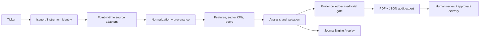

# Architecture

## Boundaries

- CVM ITR/DFP/IPE/FRE are primary filing sources.
- B3 COTAHIST supplies official historical market observations when provided.
- BCB SGS supplies macro series.
- Yahoo Finance is secondary and may be unavailable; it must not silently
  replace a missing primary filing.
- Quantitative scoring is deterministic. Qualitative content is downstream and
  must reuse sourced facts.

## Reliability controls

Each source carries availability/publication timestamps, period, version and
artifact hash. The point-in-time layer rejects future observations. The editorial
gate blocks missing sources, inconsistent periods, semantic contamination and
incomplete deliverables. Journal entries and audit exports make a run replayable.
